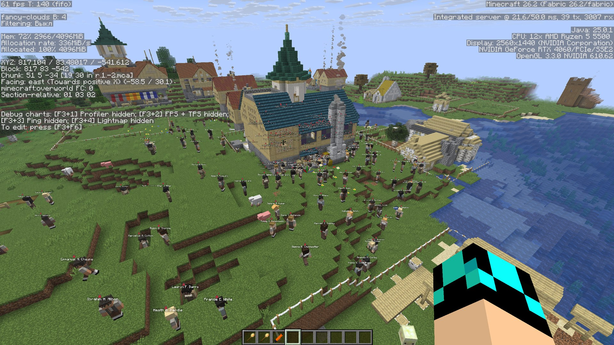
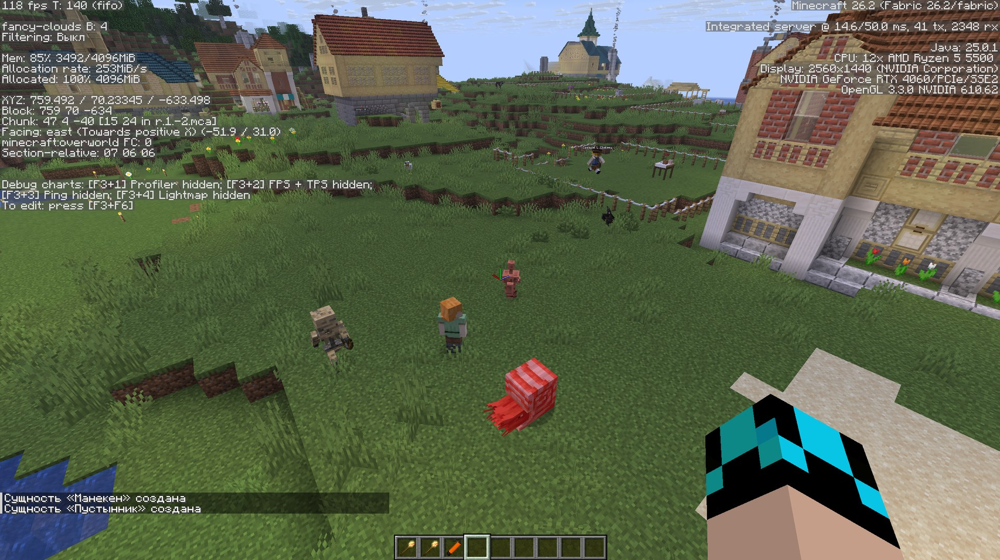
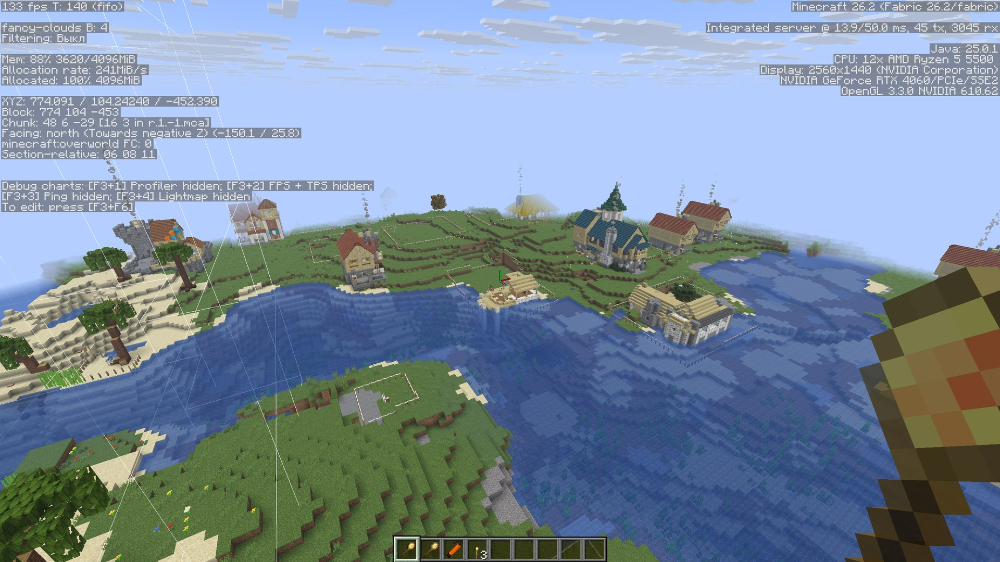
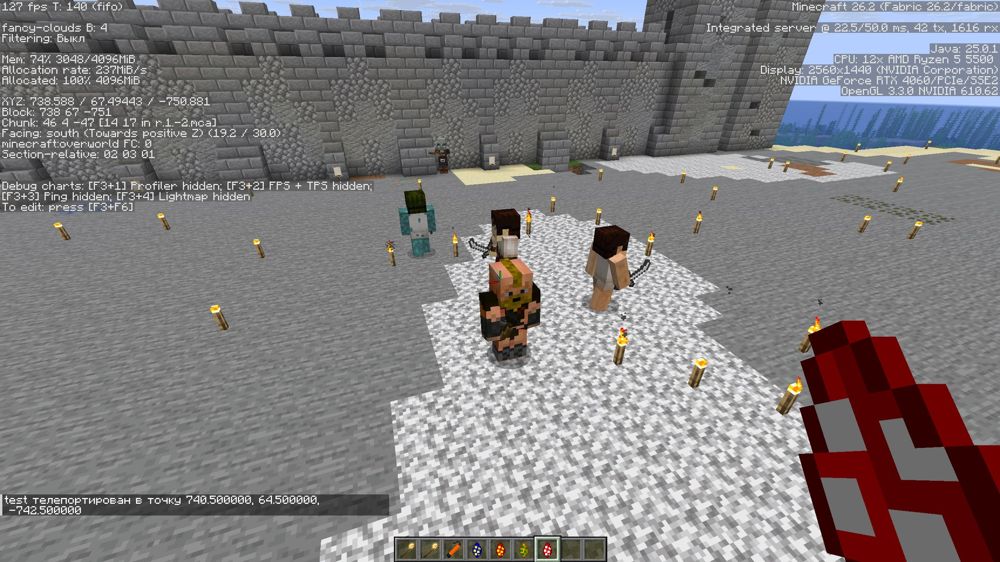
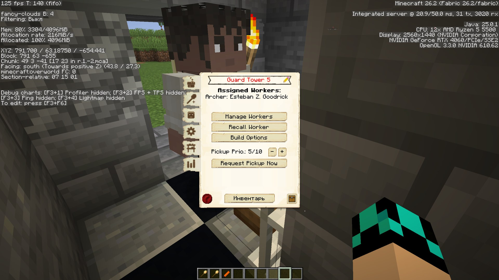
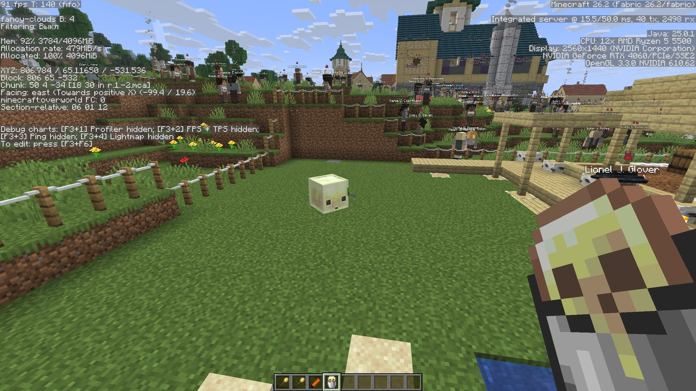
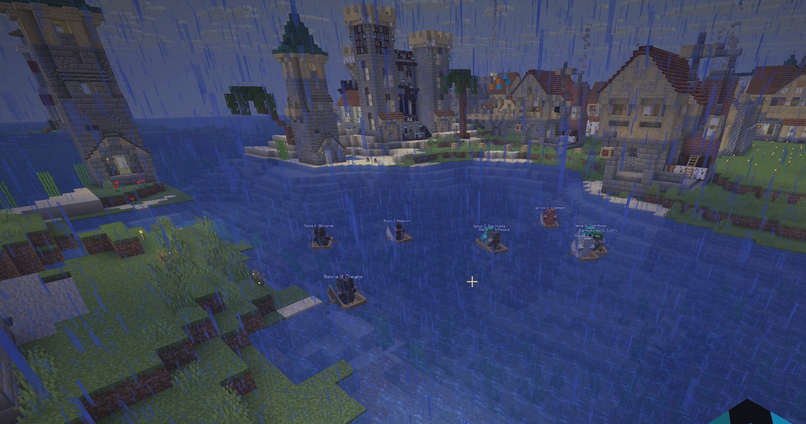

<h1 align="center">
  
  <br>
  MineColonies — Fabric port for Minecraft 26.2
</h1>

<p align="center">
  <b>Build and run a colony in Minecraft 26.2 on the Fabric loader.</b><br>
  Builders, farmers, guards, research, quests and hundreds of workers — an unofficial community port
  of <a href="https://github.com/ldtteam/minecolonies">LDTTeam's MineColonies</a> from NeoForge to Fabric,
  shipped as a single jar with its three library mods bundled inside.<br>
  <br>
  <b>Plus what was built on top of it here:</b> citizens that sail boats, three land-claim scepters with
  block-precise colony borders, outposts that actually work, a farmer that prepares its own ground —
  and fixes for bugs that have been in the mod for years.
</p>

<p align="center">
  
  
  
  
  
</p>

<p align="center">
  <a href="#-in-game">In game</a> ·
  <a href="#-download">Download</a> ·
  <a href="#-what-this-port-adds">What's added</a> ·
  <a href="#-bugs-fixed-here">Fixes</a> ·
  <a href="#-the-other-ports">Other ports</a> ·
  <a href="#-installation">Installation</a> ·
  <a href="#-building-from-source">Build</a> ·
  <a href="#%EF%B8%8F-known-limitations">Limitations</a> ·
  <a href="#-issues-and-bug-reports">Issues</a> ·
  <a href="#-the-port-kit">Port kit</a> ·
  <a href="#-credits">Credits</a> ·
  <a href="#-license">License</a>
</p>

---

## 🖼️ In game

Unedited frames from a running world. The F3 overlay is left on in all but the
last one, so the version, the loader and the Java it is actually running on are
readable in the corner: `Minecraft 26.2 (Fabric 26.2/fabric)`, Java 25,
integrated server ticking well inside its 50 ms budget.

<p align="center">
  
</p>

<p align="center">
  
</p>

<p align="center">
  <i>Four mobs that only exist in 26.2, in one frame, inside a working colony — a copper golem, a
  nautilus, a parched and a mannequin. None of them can be spawned in 1.21.1.</i>
</p>

<table>
  <tr>
    <td width="50%"></td>
    <td width="50%"></td>
  </tr>
  <tr>
    <td><b>Huts spread along the coast.</b> Blueprints place, builders finish them, claimed chunks fill in behind.</td>
    <td><b>The mod's raiders.</b> A barbarian and friends, spawned in deliberately — the mod's own entities, models and gear all render.</td>
  </tr>
  <tr>
    <td width="50%"></td>
    <td width="50%"></td>
  </tr>
  <tr>
    <td><b>A hut interface.</b> BlockUI windows, module tabs and worker assignment all work.</td>
    <td><b>A sulfur cube wanders into the pasture.</b> That mob is new in 26.2 — it does not exist in 1.21.1, the version this port started from.</td>
  </tr>
</table>

<p align="center">
  
</p>

<p align="center">
  <i>Six citizens crossing a lake under rain, each in their own boat, on their way to work. Boats are
  not in upstream MineColonies — this port <a href="#-what-this-port-adds">adds them</a>: the
  pathfinder plans the crossing, the citizen spawns a hull, sails it and steps off on the far shore.
  F3 is off in this one so the lake is actually visible.</i>
</p>

---

## 📦 Download

**The built mod jar lives in [`dist/`](dist/).** One file, nothing else to assemble.

```
dist/minecolonies-26.2-0.0.51.jar          72 MB
dist/minecolonies-26.2-0.0.51.jar.sha256   sha256sum -c to verify
```

The jar carries its three dependencies inside it through Fabric's Jar-in-Jar, and the loader brings
them up as ordinary mods:

| Nested mod | Version |
|---|---|
| `blockui` | 0.0.1 |
| `domum_ornamentum` | 26.2-1.0.0 |
| `structurize` | 26.2-1.0.0 |

> ⚠️ **Do not also put `blockui`, `structurize` or `domum_ornamentum` in `mods/` as separate files.**
> A jar in `mods/` wins over a nested one **regardless of version** — `isRoot()` is the first key in
> the loader's candidate sort — and nothing about it appears in the log. The symptom is a crash whose
> stack trace points at a line that does not exist in the current source. Details in
> [`dist/README.md`](dist/README.md).

---

## ✨ What this port adds

Everything in this section is **new relative to upstream MineColonies**, and all of it has been played
on a live client and a dedicated server rather than only compiled. Each feature has a document behind
it in [`26.2/`](26.2/) recording what was observed in game and what was measured — the links go there.
Commands and settings are collected in [`COMMANDS.md`](COMMANDS.md).

### 🛶 Citizens sail boats

Citizens **cross water by boat** instead of walking around the lake or refusing to go at all. A colony
boat entity, integrated into the mod's own pathfinder: open water is priced as a route the citizen can
take, and the path is planned through it. The citizen boards from the bank, steers, and lands on the
far shore by itself; a path replaced mid-crossing, a `stop()`, or a recalculation all put it out of the
boat rather than letting it drift off across the lake with a passenger.

Gated behind its own **`Boats` research**, mirroring upstream's `Rails` — it costs boats, needs a level
3 Fisherman, and switches off while a guard is in combat. Empty boats are discarded, and only the
citizen a boat was placed for can board it.

Measured through the real navigator: an 800-block water route builds a full path in 7–11 ms (2191
nodes); the same route swimming does not build at all. Full numbers, including what the hard 900-block
navigator limit does to long routes, in [`26.2/PATHFINDING-DISTANCE.md`](26.2/PATHFINDING-DISTANCE.md).

### 🗺️ Three claim scepters, and borders drawn block by block

| Scepter | What it does |
|---|---|
| **Land Claim** | Right-click to claim a chunk and the eight around it. No distance rule — territory may be several disconnected pieces |
| **Land Release** | The direction the mod never had: give a chunk back, or nine while sneaking, exactly undoing one claim click |
| **Border** | Draws the border **inside** a chunk as a 16×16 mask. Click to add a column, sneak-click to cut one, hold to paint |

The drawn border is **real, not cosmetic**: protection, whether a citizen calls a place home, the raid
spawner and the build tool's preview all follow the painted line rather than the chunk grid. A chunk
nobody has painted costs nothing extra to store or to send. All three scepters **draw the colony
borders while held**, redrawing as you edit them.

### 🏘️ Outposts and enclaves

Three places still measured distance to the town hall, so a colony could not really live away from its
centre. All three now ask **who owns the ground** instead — a hut claims its own footprint at any
distance (`maxoutlyingchunks`), an outpost stays chunk-loaded on its own (`maxforcedchunks`), and a
citizen gets a bed near its work rather than near the centre. Plus `/mc colony rehouse`, which moves
citizens who are already living in the wrong place.
→ [`26.2/ENCLAVE-FEATURES.md`](26.2/ENCLAVE-FEATURES.md), [`26.2/ENCLAVE-BUILD.md`](26.2/ENCLAVE-BUILD.md)

### 🌾 A farmer that prepares its own ground

- **Terraforming.** A field square the farmer cannot hoe because of what is lying there — stone, gravel,
  a path, someone's floor — is no longer skipped in silence: it is cleared, dirt is laid down and the
  square is tilled in the same pass. Water is the one hard exception. The farmer **says in chat what it
  cleared**, with a count and a per-block breakdown.
- **Field marker stick.** Click the scarecrow, drag out a rectangle with two clicks, and bind the field
  to a specific farm right there — no hut GUI, no guessing which farm claimed what.
- **Fields of any shape** in free mode: the rule is total area (default 4096 blocks, server config)
  rather than upstream's "sum of four radii ≤ 20", which capped every field at 11×11.

→ [`26.2/FARMER-TERRAFORM.md`](26.2/FARMER-TERRAFORM.md), [`26.2/FIELD-ASSIGNMENT.md`](26.2/FIELD-ASSIGNMENT.md)

### 🎣 A fisherman who sails to his water

Where a pond has **no reachable bank**, the fisherman goes out on it: a hull is conjured the way citizen
boat travel already conjures one — no boat item, no request — moored while he casts, and released on its
own if he dies, sleeps or is unassigned. Gated behind the same **`Boats` research**; a colony without it
behaves exactly as before. Shore fishing is untouched. His hut also holds **one fisherman per building
level**, five at level 5, each remembering his own ponds and carrying his own rod.

→ [`26.2/audit/FISHERMAN-AUDIT.md`](26.2/audit/FISHERMAN-AUDIT.md)

### 🐴 The Stable, unlocked — and cavalry that rides

Upstream's Stable hut block has no crafting recipe, so nothing behind it — mounted guards included — can
be reached at all. Here it has one, and a blueprint in **all 23 styles**, each derived from that style's
own cow barn rather than borrowed from another pack, filed under Military. Free mode hands out mounts
already trained and armoured. Three defects in the existing cavalry code are fixed along the way.

Once reachable, the cavalry turned out not to work either, and both faults are upstream's rather than
this port's — the same lines are in the 1.21.1 snapshot.

**A mounted guard was slower than a guard on foot.** A horse under a *player* is moved by vanilla's
`travelRidden`; that branch fires only for a `Player` controller, so a citizen-ridden horse falls into
the generic mob path, where `Mob#setSpeed` writes the same number into both the speed field and the
forward input and displacement therefore scales as `MOVEMENT_SPEED` **squared**. Measured with the
attribute pinned: 1.4432 and 2.7533 blocks/s, against **3.96** for a citizen walking. `travel` on the
cavalry horse now does for a citizen what `travelRidden` does for a player — same direction, rescaled
magnitude, linear rather than quadratic, capped at twice a walking guard so a lucky attribute roll
cannot outrun the pathfinder. After: **4.7841 and 6.6079 blocks/s**, and a 70-block leg fell from
32–48 s to 12–16 s.

**The rider never looked where he was going.** The look-ahead and the pre-emptive dismount before a
ladder both read the *horse's* navigation, which is empty for every tick of every ride — the orders
live in the rider's navigator, because vanilla redirects a controlling mob rider's move control to its
mount. 0 hits in 160 samples before, live every tick after.

Measured alongside, and left alone deliberately: the Stable's **patrol interval** defaults to six
minutes, which is why cavalry spends most of its time near the Stable. It is a hut setting.
→ [`26.2/audit/CAVALRY-SPEED.md`](26.2/audit/CAVALRY-SPEED.md),
[`26.2/audit/CAVALRY-STEERING.md`](26.2/audit/CAVALRY-STEERING.md)

### ⛏️ A mine that admits it is stuck

A shaft that hits water or lava used to stop dead in silence — the miner ticking normally, the shaft
never deepening, `/mc colony diagnose` reporting no problems for 100 000 ticks with not one block
changed. The stall is now named in chat and in `diagnose`, where it outlives the miner who found it. He
leaves the fire instead of burning to death without reacting, never aims a pickaxe at lava, and the
fluid sweep runs on the passes an early return used to skip.

→ [`26.2/audit/MINER-AUDIT.md`](26.2/audit/MINER-AUDIT.md)

### ⚔️ Raids on demand

`/mc raid <colony> now` **starts immediately** instead of waiting up to three minutes for a slow tick
and a campfire timer, and takes `size` and `strength` — 40 raiders at 2.5× health, damage and armour,
in one line. `where` reports where the raiders actually are and how many exist as entities right now;
`tp` puts you next to them; `stop` ends every raid and sweeps up the ones that outlived their event. A
raid asked for by name no longer fails with `NO_SPAWN_POINT` because the surroundings are not loaded
far enough out. Natural raids are untouched.

### 🧰 Free mode

`/mc colony freemode <colony> on` — the colony works **with no items at all**. One switch, saved with
the colony, off by default, replacing the four scattered hut checkboxes. Two mechanisms: the worker is
handed what it lacks on the spot (materials, tools, weapons, seeds, cures, food), *and* the request
system conjures what no hut setting could ever reach — crafting recipe inputs, furnace fuel, smeltery
ore, school paper, guard weapons and armour. Workers already stuck in `NEEDS_ITEM` resume without a
relog. → [`26.2/FREEMODE.md`](26.2/FREEMODE.md)

### 🩺 Diagnostics and admin commands

`/mc colony diagnose` reports what is stuck and for how long — per worker: job, AI state, how long that
state has held, plus citizens with no AI, requests no resolver took, work orders with no builder.
`/mc citizens fill`, `maxstats` and `heal` populate, level and un-stall a colony; `/mc colony
research completeall` and `teachRecipes` finish the research tree and teach every crafter everything it
is allowed to learn. `/mc colony protection <colony> off` stops one colony refusing you anything while
you work in it — the middle setting between the server-wide config and editing ranks one at a time.
→ [`COMMANDS.md`](COMMANDS.md)

### ⚙️ Configuration

- **`maxcitizenpercolony` accepts up to 1000** (default unchanged at 250), with the research ladder's
  top rung raised to match — otherwise a config of 1000 was clamped straight back to 500.
- **`stuckrescueseconds`** (new, default 60, 0 disables) teleports a worker to where its job sent it
  once it has spent that long without getting any closer.

---

## 🐞 Bugs fixed here

**These are upstream's, and they reproduce on the official NeoForge build.** Each was read line by line
in the [`1.21.1/`](1.21.1/) snapshot in this repository before being called upstream's rather than the
port's own doing — in three of the four the code is character-for-character identical.

| Symptom | What it actually was |
|---|---|
| **"The builder refuses to build."** | The *is this order inside the colony* check stepped through the footprint so that a 17×17 hut had **exactly one chunk checked — and the wrong one**, the minimum corner rather than the hut. The refusal message then named the hut's coordinates, which were fine. Every chunk is now checked, and the message names the one that is unclaimed |
| **A farm 1000 blocks away steals the field next door** | Field auto-claim never looked at distance at all |
| **A citizen keeps walking to a field that changed owner** | A stale pointer to the field, compared by identity |
| **A worker stands still forever** | The navigator's stuck handler only rescues a worker that is walking and getting nowhere. For one whose destination has no path at all, nothing moves, nothing is logged, no request is outstanding — the usual fix was breaking the hut and placing it again. `stuckrescueseconds` watches the destination instead of the path |

Two more that are **not** upstream's, kept apart from the table on purpose:

- **The farmer never hoes the ground** — reported by a player, and caused by 26.2 itself: vanilla split
  `#minecraft:dirt`, moving grass, podzol, mycelium and mud out of it, and the hoeable-surface test
  carried the old tag across verbatim. Every cell returned nothing and the farmer walked its whole
  spiral doing nothing. Fixed by switching to `#minecraft:substrate_overworld`, diffed against the real
  1.21.1 server jar so it restores the old set rather than widening it. Measured on an identical grass
  scene: 0 of 121 cells tilled before, 80 within three minutes after.
- **Oversized stacks vanishing** into an empty citizen slot is upstream's bug but upstream's fix too —
  backported here from `ldtteam/minecolonies#11772`.

Regressions **this port introduced and then found**, including three "this API has no counterpart on
Fabric" comments that were false — each having quietly disabled working game logic behind a green build
— are written up in [`26.2/AI-FIXES.md`](26.2/audit/AI-FIXES.md) and [`26.2/OPT-FIXES.md`](26.2/audit/OPT-FIXES.md).
What is **known and deliberately left**, including two findings the owner chose to ship with, is in
[`26.2/TODO.md`](26.2/todo/TODO.md).

### ⚡ Performance

Profiled on a **live 1000-citizen colony** on a dedicated server, with the pathfinding pool instrumented
through the Attach API — no line of the mod's source touched by the measurement. A round of measured
fixes shipped from it: the server tick no longer walks every colony for empty callbacks, defensive
copies of the citizen list are off the tick paths, GUI lists stopped refreshing twice, A* stopped
reading the world clock per node, courier lookups are hashed, request-system logging no longer builds
strings behind a disabled flag.

What is **still** expensive is published rather than summarised into a number: 8× citizens costs 11.5×
the tick, one pathfinding thread sits at 86 % with jobs queued a quarter second, 8 % of that thread is
CAS contention on a shared `Random`, and the tick's largest single cost at that scale is a *vanilla*
entity path, not the mod's AI. → [`26.2/AI-SCALE-AUDIT.md`](26.2/audit/AI-SCALE-AUDIT.md), with the ranked
to-do in [`26.2/TODO.md`](26.2/todo/TODO.md). The world it was measured on ships in
[`testworlds/`](testworlds/).

---

## 🧩 The other ports

MineColonies is the top of a stack of four, and the reason the other three were ported at all.
Each has its own repository, and each is also bundled inside the jar above.

| Mod | Fabric 26.2 port | Original (upstream) | Role in the stack |
|---|---|---|---|
| **BlockUI** | [unknown-wq/BlockUI](https://github.com/unknown-wq/BlockUI) | [ldtteam/BlockUI](https://github.com/ldtteam/BlockUI) | XML-driven GUI framework, plus the shared `com.ldtteam.common` layer |
| **Domum Ornamentum** | [unknown-wq/Domum-Ornamentum](https://github.com/unknown-wq/Domum-Ornamentum) | [ldtteam/Domum-Ornamentum](https://github.com/ldtteam/Domum-Ornamentum) | Skinnable decorative blocks used throughout the colony schematics |
| **Structurize** | [unknown-wq/Structurize](https://github.com/unknown-wq/Structurize) | [ldtteam/Structurize](https://github.com/ldtteam/Structurize) | Blueprint scanning and placement — how every hut gets built |
| **MineColonies** | **you are here** | [ldtteam/minecolonies](https://github.com/ldtteam/minecolonies) | The colony simulation itself |

```
BlockUI  ──┐
           ├──> Structurize ──> MineColonies
Domum Ornamentum ──────────────┘
```

> **The three libraries are straight ports** — no new features, same IDs, same behaviour, moved from
> NeoForge to Fabric and up to Minecraft 26.2. **MineColonies is that move plus the additions above.**
> Either way the gameplay, content and IDs it started from are the upstream authors' work; what is
> added here is added on top of theirs and named as such.

---

## 🚀 Installation

1. Install [Fabric Loader](https://fabricmc.net/use/installer/) 0.19.3 or newer for Minecraft 26.2.
2. Put exactly two files in `mods/`:

```
mods/
├── fabric-api-0.154.2+26.2.jar
└── minecolonies-26.2-0.0.51.jar
```

3. Launch. In the loaded-mod list, `blockui`, `domum_ornamentum` and `structurize` must appear
   **indented under `minecolonies`**. If any of them is at the top level, there is a stray jar in
   `mods/` — remove it.

The mod is required on both client and dedicated server. Java 25 is a hard requirement of Minecraft
26.2 itself.

---

## 🔨 Building from source

```sh
./gradle-dist/install.sh                       # installs Gradle 9.6.1 to /opt and OpenJDK 25
export JAVA_HOME=/usr/lib/jvm/java-25-openjdk-amd64

cd 26.2
/opt/gradle-9.6.1/bin/gradle build             # jar lands in 26.2/build/libs/
```

The three dependency jars are taken from the paths in `26.2/gradle.properties`; build them from
their own repositories first, or point those properties at the jars in their `dist/` folders.
`./gradlew` does not work here — the wrapper cannot fetch GitHub release assets through the proxy.

Useful tasks: `runClient`, `runServer`, `runDatagen`, `validateAccessWidener`. Minecraft 26.1+ ships
unobfuscated, so the build carries **no mappings line**.

---

## 🧭 How the port was done

The largest of the four ports by a wide margin: **2051 source files, ~306k lines**, three mod
dependencies that had to be ported first, and both axes to cross at once — Minecraft 1.21.1 → 26.2
*and* NeoForge → Fabric. The base is upstream's `version/1.21` branch (NeoForge 21.1.80, Java 21).

- **Nine agents over three waves**, split strictly by file rather than by package, starting from
  9650 compile errors. The brief every one of them read first is
  [`26.2/AGENT-BRIEF.md`](26.2/AGENT-BRIEF.md).
- **Datagen verified against the previous version's output as an oracle** — 5039 files compared one
  by one, including 3481 generated textures compared by pixel.
- **The production artefact was tested, not the dev classpath.** The built jar was installed into a
  real Fabric server (`fabric-installer`, loader 0.19.3, only Fabric API alongside) and booted:
  `Done (4.421s)!`, zero `/ERROR]` lines, dependencies loading as nested mods.
- **Then it was played.** Roughly three person-days of hands-on testing on a live client and a
  dedicated server — colonies founded and grown, huts placed and built, the hut GUIs and module tabs
  driven by hand, workers followed around, raids called in, and every feature in
  [*What this port adds*](#-what-this-port-adds) exercised in game. That is where the player-reported
  bugs in the section after it came from.
- **Datapacks load for real**: 161 recipes across 16 crafters, 208 researches in 4 branches, 103
  effects, quests, 1761 items with NBT keys.
- **The AI subsystem was audited separately** afterwards — `core/entity/ai`, `pathfinding`,
  `api/entity/ai` — and the audit caught something worth knowing: three "this API has no counterpart
  on Fabric" comments were **false**, and each had quietly disabled working game logic behind a green
  build. See [`26.2/AI-AUDIT.md`](26.2/audit/AI-AUDIT.md) and [`26.2/AI-FIXES.md`](26.2/audit/AI-FIXES.md).

The full record is in [`26.2/PORT-STATUS.md`](26.2/PORT-STATUS.md), and the API delta measured against
this specific codebase — every breaking rename with its real hit count — in
[`API-CHECKLIST-26.2.md`](API-CHECKLIST-26.2.md). Everything under
[*What this port adds*](#-what-this-port-adds) came afterwards, once the port itself was green.

---

## ⚠️ Known limitations

Some NeoForge-only hooks have no counterpart in Fabric or in vanilla 26.2. Everything cut was kept
in place, commented and logged rather than deleted. The last row is not a loss at all — it is a
limit the original had too, listed here because it is the one players hit and then go looking for a
setting that does not exist.

| Area | What differs from upstream | Impact |
|---|---|---|
| **Colony protection** | `ItemTossEvent` and `ItemEntityPickupEvent` have no Fabric counterpart | `TOSS_ITEM` and `PICKUP_ITEM` are not enforced: a stranger inside the borders may still drop items and pick them up. Every other permission works, `PLACE_BLOCKS`/`PLACE_HUTS`, `FILL_BUCKET`, `SHOOT_ARROW`, `BREAK_BLOCKS`, `ACCESS_HUTS` and `ATTACK_CITIZEN` among them |
| **Explosions** | Fabric API ships no explosion callback, and reaching one generically needs a mixin | Colony **blocks** are not shielded from vanilla explosions — a creeper, TNT or a bed in the Nether takes the blueprint apart. Aircraft blasts are shielded through Simple Planes' own guard seam, and the damage half of `turnoffexplosionsincolonies` — sparing citizens and livestock — works for every explosion in the game |
| **Fire and mob griefing** | 26.2 routes both through world-wide gamerules with no per-region hook | Neither can be narrowed to a colony. Upstream did not hook them either, so nothing was lost here — but `fire_spread_radius_around_player` and `mob_griefing` are the only levers, and they change the whole world. [`COMMANDS.md`](COMMANDS.md) explains both |
| **Spear in hand and inventory** | `BlockEntityWithoutLevelRenderer` was removed from vanilla | Renders as a flat item model |
| **Citizen fallback model** | `Model#renderToBuffer` is final in 26.2 and draws the whole root | The default citizen shows player overlays (jacket, sleeves) that 1.21.1 did not |
| **`TravellingManager` save format** | Moved to `BlockPos.CODEC` | Old worlds read that one field back as `BlockPos.ZERO` |
| **Restaurant menu ingredients** | `Level#getRecipeManager` does not exist on the client | Only MineColonies' own recipes are parsed for ingredients |
| **Colony creation particle** | The vanilla particle type changed shape in 26.2 | A different effect plays |

Each is recorded in [`26.2/PORT-STATUS.md`](26.2/PORT-STATUS.md) → *Disabled content*, with what it
looks like in game and how to repair it. Several losses were already recovered there — colony crops
in vanilla loot tables, supply chests, compostables, the map and tablet item overlays, and the
cavalry horse renderer all went back in after the first pass; the scarecrow's lantern and the colony
flag's creative placeholder went back in after the second, both onto 26.2's replacements for
`renderSingleBlock` and `renderStatic`.

---

## 🐞 Issues and bug reports

**Found a problem? [Open an issue](https://github.com/unknown-wq/minecolonies/issues) — please do.**
Bug reports are genuinely welcome; that is how the remaining rough edges get found.

- Report **bugs from this build here**, not to LDTTeam. Anything caused by the move to Fabric 26.2, and
  everything under [*What this port adds*](#-what-this-port-adds), is this repository's doing.
- Helpful things to include: Minecraft / Fabric Loader / Fabric API versions, the full log
  (`logs/latest.log` or the crash report), the other mods installed, and the steps that reproduce it.
- **Check `mods/` first** if something crashes on startup: a stray `blockui`, `structurize` or
  `domum_ornamentum` jar shadows the bundled copy silently, and the resulting stack traces are
  misleading.
- If the same bug also happens on upstream's NeoForge build, it belongs
  [upstream](https://github.com/ldtteam/minecolonies/issues) instead.

---

## 🧰 The port kit

The reusable kit all four ports were run from — and that this one extended the most — now lives in
its own repository: **[unknown-wq/port-kit](https://github.com/unknown-wq/port-kit)**. It holds the
plan, per-area recipes, ready prompts for an agent team, document templates, the rename and
import-resolution scripts, raw findings, and the record of every finished port.

Start with [`PORTING-BUNDLE-26.2.md`](https://github.com/unknown-wq/port-kit/blob/main/PORTING-BUNDLE-26.2.md)
— the whole kit as one file — or the repository's own README for the index.

---

## 📁 Repository layout

```
.
├── dist/                  # release notes; the built jar is published separately
├── 26.2/                  # the Fabric 26.2 port — sources, build, and every document below
│   ├── PORT-STATUS.md         # what was ported, what was cut, what came back
│   ├── audit/                 # every audit, and what each one changed
│   │   ├── AI-AUDIT.md            # the AI subsystem, with AI-FIXES.md alongside it
│   │   ├── AI-SCALE-AUDIT.md      # what breaks at 1000 citizens, measured live
│   │   ├── MINER-AUDIT.md         # ↓ one per worker, each measured on a live server
│   │   ├── FISHERMAN-AUDIT.md
│   │   ├── FARMER-AUDIT.md
│   │   └── REVIEW-2.md            # the review of this branch, findings and decisions
│   ├── todo/                  # designed, measured or known — and not done
│   │   ├── TODO.md
│   │   └── VANILLA-26.2-OPPORTUNITIES.md   # what 26.2 vanilla now does better than the port
│   ├── PATHFINDING-DISTANCE.md    # rails, water and the 900-block navigator limit
│   ├── ENCLAVE-FEATURES.md    # ↓ one document per added feature
│   ├── FARMER-TERRAFORM.md
│   ├── FIELD-ASSIGNMENT.md
│   ├── FREEMODE.md
│   └── plans/                 # five designs awaiting a decision, none implemented
├── 1.21.1/                # read-only snapshot of upstream version/1.21 (NeoForge 21.1.80) — the base
├── testworlds/            # the 1000-citizen colony and the boat arenas, as server worlds
├── docs/screenshots/      # the frames shown above
├── docs/CURSEFORGE.md     # the release description, for the CurseForge page
├── COMMANDS.md            # every added command, item and config option, in one place
├── UPSTREAM-SYNC.md       # which upstream commit the snapshot sits on, and what has been taken since
├── API-CHECKLIST-26.2.md  # the API delta measured against this codebase, with hit counts
└── gradle-dist/           # vendored Gradle 9.6.1 + toolchain installer
```

The snapshot folder is upstream code, kept verbatim for reference and diffing. It is not edited and
is not part of the build — it is also what every "this bug is upstream's, not the port's" claim in
this README was checked against. Which upstream commit it sits on, and every upstream commit since
that was taken, skipped or found already present here, is tracked in
[`UPSTREAM-SYNC.md`](UPSTREAM-SYNC.md).

---

## 🙏 Credits

**MineColonies is the work of [LDTTeam (Let's Dev Together)](https://github.com/ldtteam)** and its
many contributors — a mod with more than a decade of history behind it. Every worker, hut, research
branch, schematic and line of game logic in this repository originates with them. All credit belongs
to the original authors:

- Upstream source: **[github.com/ldtteam/minecolonies](https://github.com/ldtteam/minecolonies)**
- Website: [minecolonies.com](https://minecolonies.com/) · CurseForge:
  [MineColonies](https://www.curseforge.com/minecraft/mc-mods/minecolonies)
- Discord: [LDTTeam](https://discord.gg/Tb3PagMpaG) · support them on
  [Patreon](https://www.patreon.com/Minecolonies)

This repository is an **unofficial, community-maintained port to the Fabric loader**, with the
features under [*What this port adds*](#-what-this-port-adds) built on top of their work. It is not
affiliated with, endorsed by or supported by LDTTeam — please do not send them support requests
about this build, and do not report anything from it as an upstream bug unless it reproduces on
their NeoForge build.

---

## 📄 License

MineColonies is licensed under the **GNU General Public License, version 3 only**, and this port is
distributed under the same license and its terms. The full text ships with the source, in
[`26.2/LICENSE`](26.2/LICENSE) and [`1.21.1/LICENSE`](1.21.1/LICENSE).

```
MineColonies — a colony simulator for Minecraft
Copyright (C) LDTTeam (Let's Dev Together) and the MineColonies contributors
Copyright (C) unknown-wq — Fabric / Minecraft 26.2 port

This program is free software: you can redistribute it and/or modify it under
the terms of the GNU General Public License version 3 as published by the Free
Software Foundation.

This program is distributed in the hope that it will be useful, but WITHOUT ANY
WARRANTY; without even the implied warranty of MERCHANTABILITY or FITNESS FOR A
PARTICULAR PURPOSE.  See the GNU General Public License for more details.

You should have received a copy of the GNU General Public License along with
this program.  If not, see <https://www.gnu.org/licenses/>.
```

### What is not in this repository

MineColonies' artwork is All Rights Reserved and belongs to LDTTeam, so **no MineColonies
asset is stored here**. One tree is absent from every commit:

| Absent | What it was | Why |
|---|---|---|
| `26.2/src/main/resources/assets/minecolonies/` | textures, sounds, models, blockstates, GUI, particles, shaders, the language file | governed by its own `LICENSE` file reading **All Rights Reserved** |

That tree is likewise absent from the `1.21.1/` upstream snapshot, as is its generated asset
output. **Blueprints are not affected and ship as before**: `26.2/src/main/resources/blueprints/`
carries no licence file of its own and so falls under the GPLv3 above — the All-Rights-Reserved
marker covered `assets/minecolonies/` alone. 115 of those blueprints are this port's own work in
any case: the Stable in all 23 styles, which exists in no upstream commit.

What remains is everything except that one tree: the Java source, the build, the data files, the
blueprints, the structure templates and the documentation — all of it under the GPLv3 above.

A build made from this repository alone therefore ships **no artwork**. Minecraft substitutes
placeholder textures for anything missing and stays silent where a sound is absent, so the game
still runs; how the assets reach a player is being worked out separately.

The copyright in the mod itself stays with LDTTeam and its contributors; the port adds to their work
rather than replaces it, and the GPL is what makes redistributing it this way possible. The three
bundled library mods — Structurize, BlockUI and Domum Ornamentum — are LDTTeam's as well and carry
their own licenses, which travel with them inside the jar.
